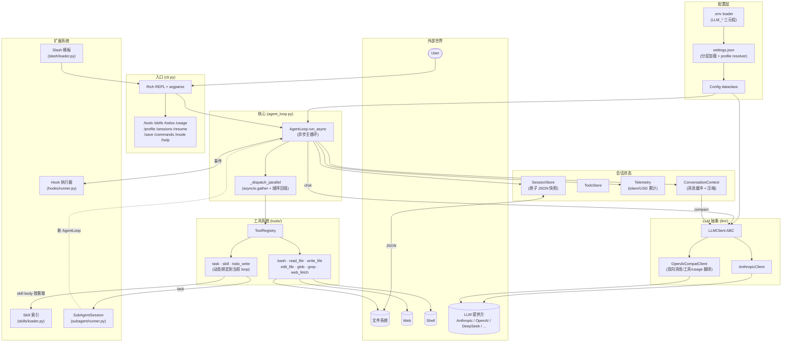
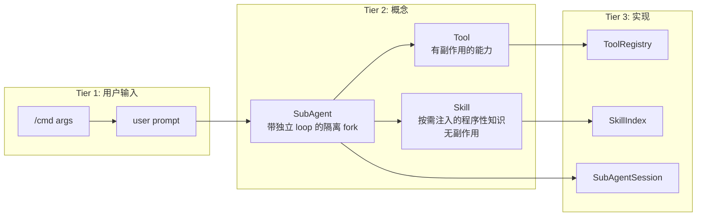

# 系统架构

本文档面向想理解 miniClaudeCode 整体设计的读者。看完之后你应该能回答：每个模块负责什么、它们之间怎么协作、扩展点在哪里。

如果你还没读过 [implementation-plan.md](implementation-plan.md)，建议先扫一眼 Phase 划分，再看本文。

---

## 1. 三句话概括

> **Agent Loop 是灵魂，工具是双手，权限是护盾。**

整个系统是一个异步循环：把用户消息发给 LLM → 拿到回复（可能含工具调用）→ 并行执行工具 → 把结果再喂回 LLM → 直到 LLM 不再调用工具。所有"花活"（subagent、skill、hooks、压缩、telemetry、session）都挂在这个循环的不同钩子上。

---

## 2. 高阶架构



> **读图小贴士**：实线表示同步调用，虚线表示"递归实例化新的 AgentLoop"（subagent fork）。

---

## 3. 模块清单

| 模块 | 文件 | 职责 |
|---|---|---|
| **入口** | [cli.py](../miniclaudecode/cli.py) · [\_\_main\_\_.py](../miniclaudecode/__main__.py) | argparse / Rich REPL / slash 分发 / `.env` 与 settings 加载 / session 自动保存 |
| **核心循环** | [agent_loop.py](../miniclaudecode/agent_loop.py) | 异步 turn loop + `asyncio.gather` 并行 dispatch + 工具绑定 + hooks 钩入 + 压缩触发 + telemetry 记录 |
| **配置** | [config.py](../miniclaudecode/config.py) · [settings.py](../miniclaudecode/settings.py) | `Config` dataclass / settings.json 分层 / `.env` 加载 / profile resolver |
| **LLM 抽象** | [llm/base.py](../miniclaudecode/llm/base.py) · [llm/anthropic_client.py](../miniclaudecode/llm/anthropic_client.py) · [llm/openai_compat.py](../miniclaudecode/llm/openai_compat.py) | `LLMClient` ABC + 两个具体实现，OpenAI 客户端做 Anthropic ↔ OpenAI 双向翻译 |
| **工具** | [tools/](../miniclaudecode/tools/) | Tool ABC + Registry + 7 个核心工具 + 3 个动态工具 (task/skill/todo_write) |
| **权限** | [permissions.py](../miniclaudecode/permissions.py) | 2 层权限门：tool 自检 + ASK/AUTO/PLAN 模式 |
| **上下文** | [context.py](../miniclaudecode/context.py) | 消息缓冲 + token 估算 + 压缩（Haiku 总结中段） |
| **system prompt** | [system_prompt.py](../miniclaudecode/system_prompt.py) | 模板组合：基底 + 工具列表 + 权限说明 + skill 索引 + CLAUDE.md |
| **Skills** | [skills/loader.py](../miniclaudecode/skills/loader.py) · [tools/skill_tool.py](../miniclaudecode/tools/skill_tool.py) | YAML frontmatter md 解析 + 项目/用户合并 + 按需取 body |
| **SubAgent** | [subagent/runner.py](../miniclaudecode/subagent/runner.py) · [tools/task_tool.py](../miniclaudecode/tools/task_tool.py) | 隔离 context 的子 loop + 深度上限 + 共享 hooks/telemetry |
| **Hooks** | [hooks/runner.py](../miniclaudecode/hooks/runner.py) | shell 命令钩子，stdin/stdout JSON 协议，30s 超时 |
| **Telemetry** | [telemetry.py](../miniclaudecode/telemetry.py) | token/USD 累计 + Rich 面板 + 定价表覆盖 |
| **持久化** | [persistence/session.py](../miniclaudecode/persistence/session.py) | 原子 JSON 快照 + `restore_into` |
| **Slash 模板** | [slash/loader.py](../miniclaudecode/slash/loader.py) | 用户自定义 `/<name>` 命令模板，`{args}` `{1}` `{2}` 占位 |

代码体量：核心 ~3500 行 + 测试 ~1500 行 = **总 ~5000 行**，**131 个测试全过**。

---

## 4. 关键概念分层



三个核心概念**严格区分**：
- **Tool** = 执行（有副作用），通过 LLM 的 tool_use 调用
- **Skill** = 知识注入（无副作用），通过 `skill` 工具按需取出 body
- **SubAgent** = fork（带独立 loop + 隔离 context），通过 `task` 工具派发

> 这三者很容易混淆。比如"代码审计"应该是 skill 还是 subagent？答：**skill 写"该怎么做"，subagent 才"真的去做"**。模型会先 `skill(name="python-review")` 拿到 procedure，然后用 `task(...)` 把活分发出去。

---

## 5. 配置解析优先级

四层叠加，高优先级覆盖低优先级：

```
CLI flags  >  --profile X  >  settings.profile  >  LLM_*(env-driven)  >  "anthropic"
```

详细规则见 [technical-details.md](technical-details.md#配置解析优先级)。

---

## 6. 扩展点速查

| 想做什么 | 改/加哪里 |
|---|---|
| 加新工具 | 写一个 `Tool` 子类，注册到 [ToolRegistry](../miniclaudecode/tools/base.py) |
| 加新 LLM 提供方 | 实现 `LLMClient` 子类（已有 OpenAI 兼容覆盖了大部分中转站） |
| 加新中转站 | 不用写代码 — `.env` 三行 (`LLM_BASE_URL/LLM_API_KEY/LLM_MODEL`) 或 [settings.json](../.miniclaudecode/settings.json) 加一条 profile |
| 加新 hook 事件 | 在 [HookRunner.fire](../miniclaudecode/hooks/runner.py) 加事件名，agent_loop 在合适位置 `await self.hooks.fire(...)` |
| 加新 slash 命令（用户级） | 写 `./.miniclaudecode/commands/<name>.md` |
| 加新 skill | 写 `./.miniclaudecode/skills/<name>.md` |
| 改 token 压缩策略 | [context.py](../miniclaudecode/context.py) 的 `compact_if_needed` |
| 改 token 价格表 | [telemetry.py](../miniclaudecode/telemetry.py) `DEFAULT_PRICING` 或 settings.json `pricing` |

---

## 7. 进一步阅读

- 运行时流程时序图 → [flow-diagrams.md](flow-diagrams.md)
- 实现细节深入（顺序保持、上下文隔离、压缩安全、原子写） → [technical-details.md](technical-details.md)
- 设计决策的 Q&A → [interview-qa.md](interview-qa.md)
