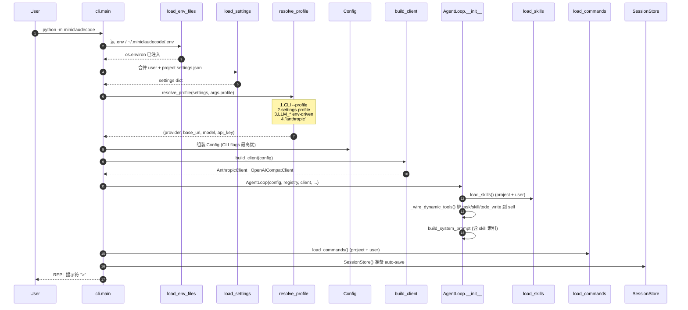
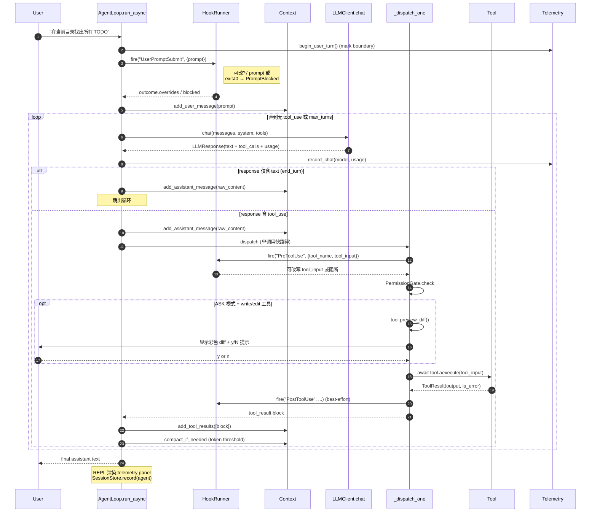
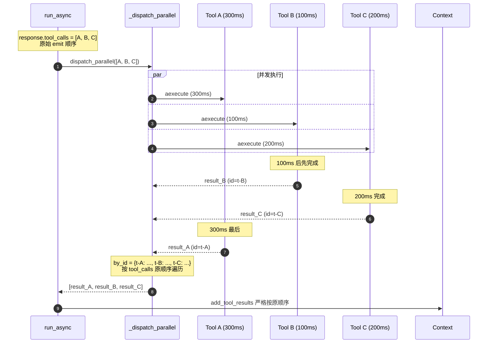
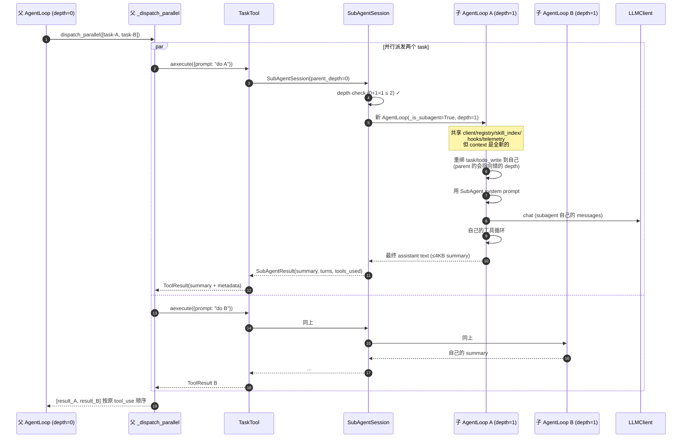
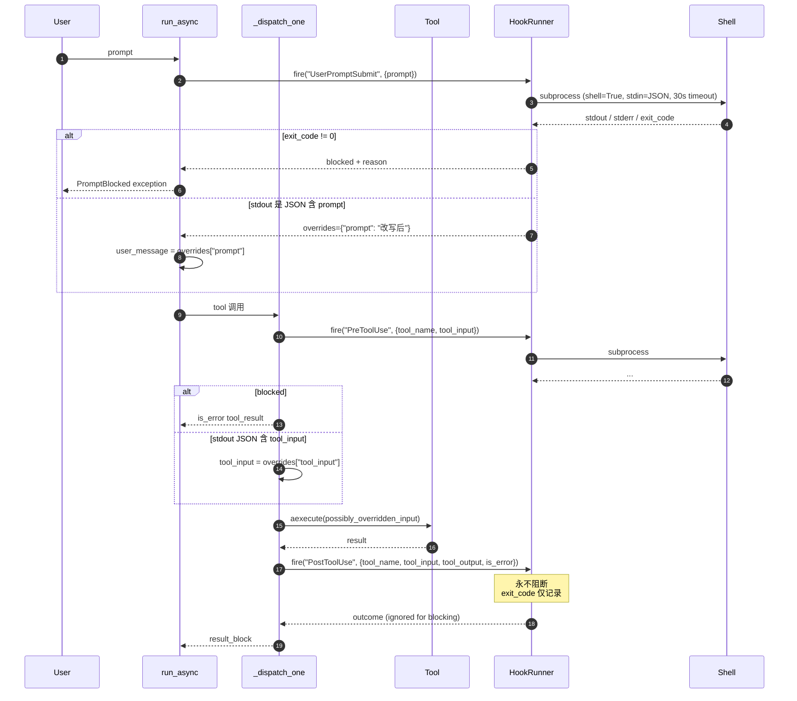
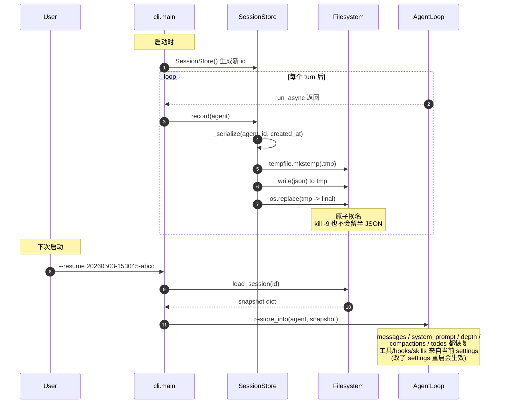
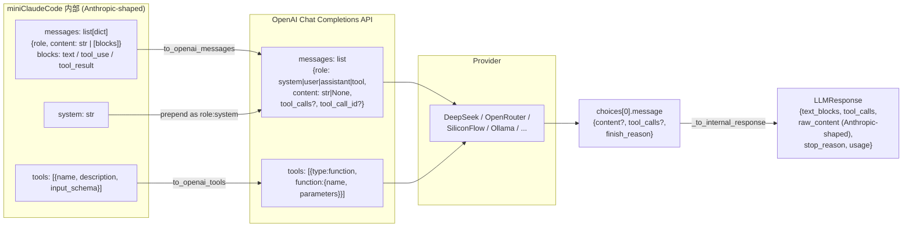
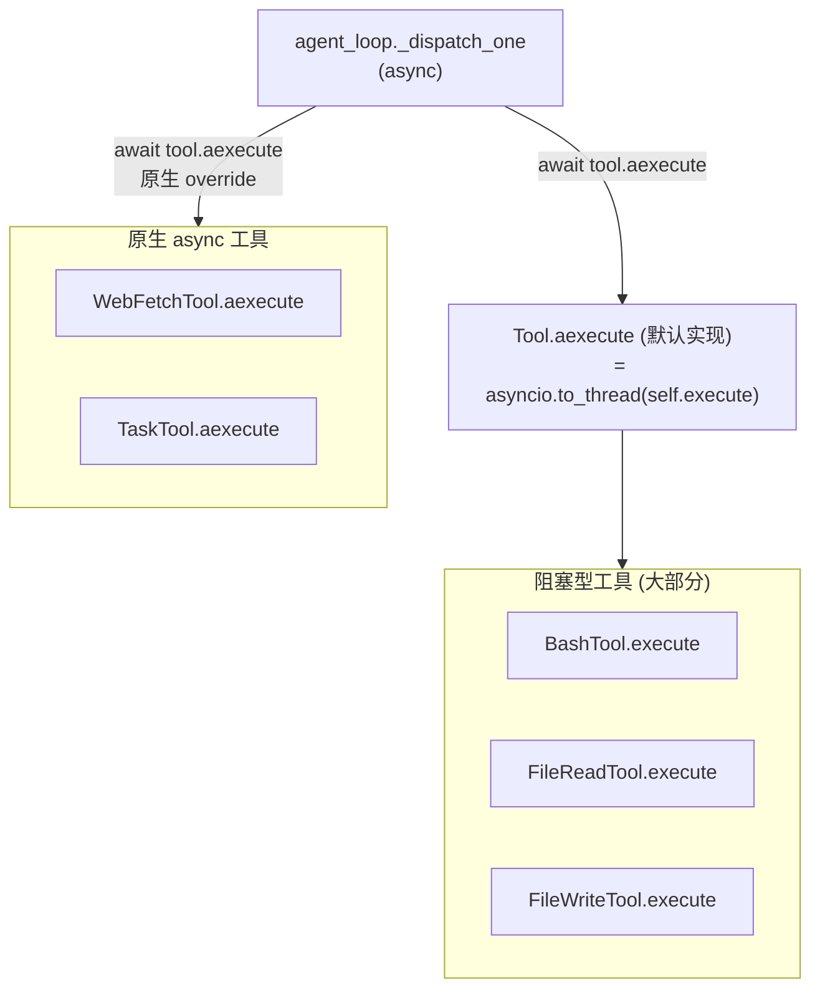

# 运行时流程图

本文档用 mermaid 时序图展示几个关键运行时路径。配合 [architecture.md](architecture.md) 看模块责任，配合 [technical-details.md](technical-details.md) 看实现细节。

GitHub / VSCode / Typora 都能直接渲染 mermaid。

---

## 1. 启动到第一个 turn 的完整路径



---

## 2. 一个 user turn：单工具串行

最简单的情况 — LLM 想用 1 个工具。



> 注意第 4 步的 `begin_user_turn()`：telemetry 拿这个 marker 拆"本轮 token vs 累计 token"。

---

## 3. 并行 dispatch + 顺序保持

LLM 一个 turn 里发出 N 个 tool_use 时的关键路径。**这是整个项目最容易踩坑的点**：Anthropic API 强制要求 `tool_result` 顺序与 `tool_use` 完全一致，错位会 400。



**任一工具抛异常**：被 `asyncio.gather(return_exceptions=True)` 捕获，转成 `is_error=true` 的 tool_result，兄弟工具继续完成。

---

## 4. SubAgent 派发（含并行）

模型在一个 turn 里同时发两个 `task` 时：



**深度上限**：subagent (depth=1) 还能再 spawn (depth=2)，但 depth=2 spawn depth=3 会被拒绝（`session.run` 直接返回，**零 LLM 调用**）。详见 [interview-qa.md](interview-qa.md#为什么深度上限定为-2)。

---

## 5. Hooks 三事件全景



---

## 6. Context 自动压缩

每个 turn 收尾时（**绝不在 tool_use → tool_result 配对之间**）触发：

```mermaid
sequenceDiagram
    autonumber
    participant LP as run_async
    participant CTX as Context
    participant LLM as LLMClient (Haiku)

    Note over LP: 一个 turn 完整结束<br/>已 add_tool_results
    LP->>CTX: compact_if_needed(client)
    CTX->>CTX: estimate_tokens()
    CTX->>CTX: > context_window * compact_threshold_ratio?
    alt 不超 → 直接返回 False
        CTX-->>LP: False
    else 超阈值
        Note over CTX: head = messages[:1] (种子任务)<br/>tail = messages[-keep_recent:]<br/>middle = messages[1:-keep_recent]
        CTX->>LLM: chat(model=compact_model="claude-haiku-4-5",<br/>system="你是上下文总结助手",<br/>user=渲染中段)
        LLM-->>CTX: summary text
        CTX->>CTX: messages = head + [user("&lt;summary&gt;...")] + tail
        CTX->>CTX: compactions += 1
        CTX-->>LP: True
    end
    Note over LP: 失败则吞掉异常 + warning<br/>主 agent 不会因压缩死
```

**为什么不在 tool 配对中间压缩**：Anthropic API 要求每个 `tool_use` 后必须紧跟其 `tool_result`，如果切片切到中间会让 API 直接 400。

---

## 7. Session 持久化与恢复



---

## 8. OpenAI 兼容客户端的双向翻译

非时序图，但展示一个 turn 的双向数据流。



关键翻译规则（详见 [technical-details.md](technical-details.md#openai-兼容层的边界条件)）：
- `tool_use` → OpenAI `tool_calls`，arguments 必须 JSON 字符串
- 仅 tool_calls 时 assistant.content 必须 `None` 而非 `""`
- `tool_result` → 单独一条 `role: "tool"` 消息，`is_error=True` 内联前缀 `[ERROR]`
- 空 tools 列表必须**省略**字段（不能传 `[]`，部分中转会拒）
- finish_reason `"tool_calls"` ↔ Anthropic `"tool_use"`，`"stop"` ↔ `"end_turn"`，`"length"` ↔ `"max_tokens"`

---

## 9. 工具的 sync ↔ async 桥接

为什么 `Tool.execute` 是 sync 但 loop 是 async？



**默认 aexecute** 把 sync `execute` 丢到 `asyncio.to_thread` 去跑（用线程池避免阻塞 event loop）。**原生 async 工具** 直接 override `aexecute`，不浪费线程。
